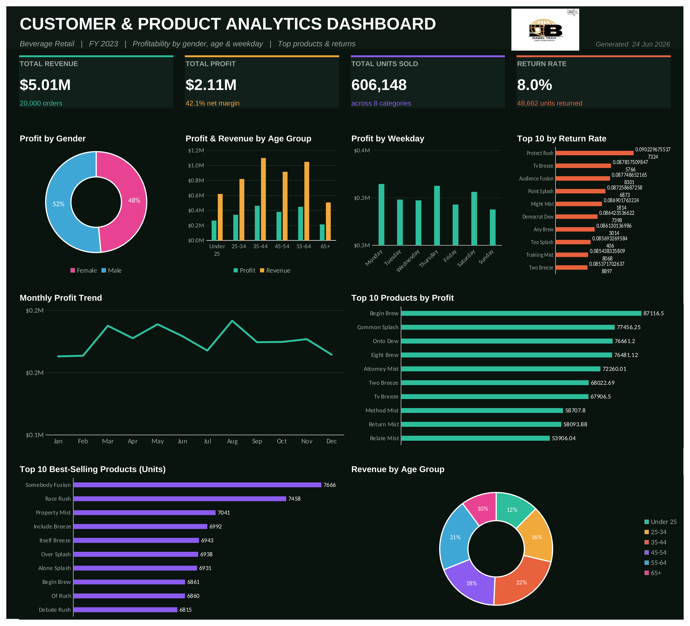
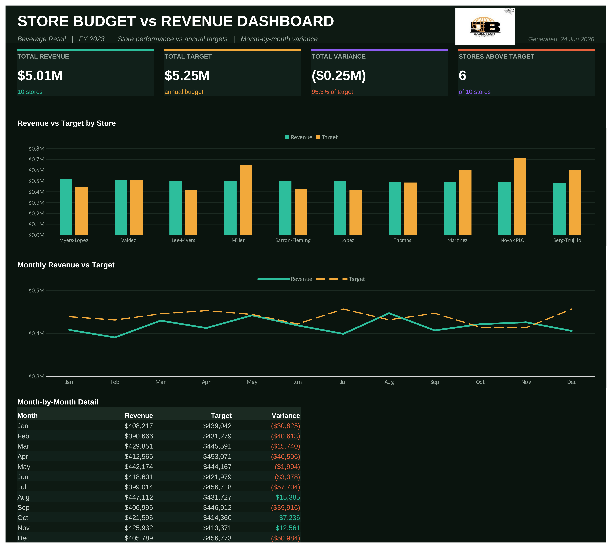
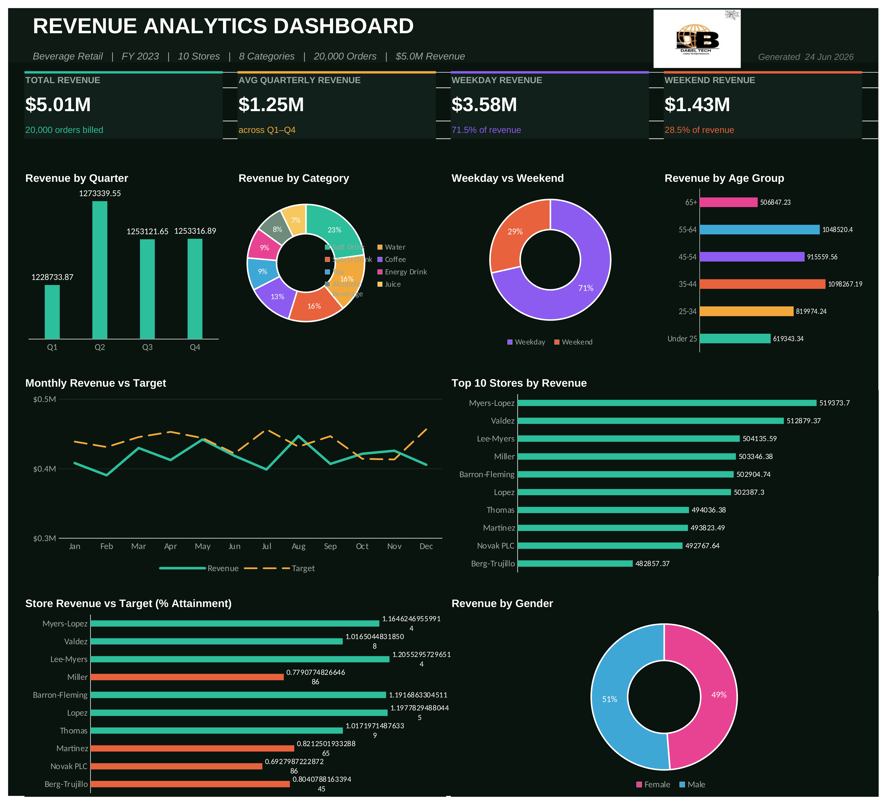

# Sales Performance Analytics — Multi-Tool Dashboard Project

An end-to-end retail sales analytics project built on a 20,000-row transaction dataset.
The same analytical model is implemented across **Excel, Python, SQL Server (T-SQL), and R**,
culminating in three interactive Excel dashboards exported as high-resolution images.

> **Domain:** Beverage retail · **Period:** FY 2023 · **Grain:** one row per order line
> · **Scale:** 20,000 transactions across 10 stores, 100 products, 600 customers.

---

## Dashboards

### 1 · Customer & Product Analytics
Profitability by gender and age group, monthly profit trend with month-over-month growth,
profit by weekday, and top products by profit, units sold, and return rate.



### 2 · Store Budget vs Revenue
Each store's actual revenue against its annual target, total variance, count of stores
above target, the monthly revenue-vs-target trend, and a month-by-month variance detail table.



### 3 · Revenue Analytics
Quarterly revenue against the quarterly average, weekday-vs-weekend split, revenue by
category and age group, top stores, and monthly revenue vs target.



---

## Key findings

- **Total revenue:** $5.01M · **Total profit:** $2.11M · **Net margin:** 42.1%
- **Overall return rate:** 8.0% (48,662 of 606,148 units).
- **Revenue is split almost evenly by gender** (Male 51% / Female 49%) and is **remarkably
  flat across age groups** — average spend per order sits near $250 in every band.
- **Quarterly revenue is stable** (~$1.25M each quarter); there is no strong seasonal swing.
- **Weekday trade dominates:** 71.5% of revenue lands Mon–Fri vs 28.5% on weekends.
- **Store performance is the clearest action item.** Revenue is even across stores, but
  three stores miss target badly because their targets are far higher:
  Novak PLC (−$219K), Miller (−$143K), and Berg-Trujillo (−$118K). Six of ten stores beat target.

---

## Repository structure

```
.
├── data/                       # Source CSVs (star schema: fact + 4 dimensions)
│   ├── fact_table.csv
│   ├── customers_table.csv
│   ├── products_table.csv
│   ├── sales_persons_table.csv
│   └── monthly_store_targets.csv
├── dashboards/
│   ├── workbook/               # The live Excel workbook (formulas + charts)
│   └── images/                 # 600-DPI dashboard exports
├── analysis/
│   ├── python/sales_analysis.py            # pandas pipeline
│   ├── sql/sales_analysis_sqlserver.sql    # T-SQL: schema, view, KPI queries
│   └── r/sales_analysis.R                  # tidyverse pipeline
└── docs/
    ├── Excel_Formula_Reference.md          # every workbook formula, documented
    └── Project_Requirements.pdf            # original KPI brief
```

---

## Data model

A simple star schema. The fact table holds order lines; four dimension tables describe the
products, customers, sales persons, and monthly store targets.

| Table | Grain | Key columns |
|---|---|---|
| `fact_table` | order line | Product ID, Customer ID, Sales Person ID, Quantity Sold/Returned, Order Date |
| `products_table` | product | Sales Price, Cost Price, Category |
| `customers_table` | customer | Gender, Location, Date of Birth |
| `sales_persons_table` | sales person | Store Name |
| `monthly_store_targets` | store × month | Monthly Target |

**Modeling decisions (consistent across all four implementations):**

1. **Revenue is on net units** (sold − returned), so returns are already netted out of revenue
   and profit. `Profit = (QtySold − QtyReturned) × (SalesPrice − CostPrice)`.
2. **Store attribution:** the fact table has no store key, so each Sales Person ID is treated
   as its Store ID (a clean 1:1 in this dataset); store revenue rolls up via the sales person.
3. **Customer age** is computed as of 2023-12-31 and bucketed into six bands.

---

## The four implementations

This project deliberately solves the same problem four ways — a demonstration that the
analytical logic is tool-independent and that I can deliver in whichever stack a team uses.

| Tool | File | Highlights |
|---|---|---|
| **Excel** | `dashboards/workbook/` | `SUMIF` / `SUMPRODUCT` / `COUNTIF`, live formulas, native charts |
| **Python** | `analysis/python/sales_analysis.py` | pandas `groupby`, `merge`, time-series |
| **SQL Server** | `analysis/sql/sales_analysis_sqlserver.sql` | `vSales` view, window functions (`LAG`, `AVG() OVER`), `FULL OUTER JOIN` |
| **R** | `analysis/r/sales_analysis.R` | dplyr, lubridate, tidyr |

All four produce identical numbers (verified): weekday revenue $3.58M, weekend $1.43M,
four near-equal quarters (~$1.25M), 8.03% return rate.

---

## Running the analysis

**Python** (pandas):
```bash
pip install pandas numpy
python analysis/python/sales_analysis.py data/
```

**R** (tidyverse):
```bash
Rscript analysis/r/sales_analysis.R data/
```

**SQL Server** (T-SQL): open `analysis/sql/sales_analysis_sqlserver.sql` in SSMS, point the
`BULK INSERT` paths at `data/`, run the script. It creates the tables, an enriched `vSales`
view, and one query per dashboard KPI.

**Excel:** open `dashboards/workbook/Sales_Performance_Dashboard.xlsx`. Every figure is a live
formula reading from the `Data` sheet, so editing the source data recalculates all dashboards.

---

## License

Released under the MIT License — see [LICENSE](LICENSE).
